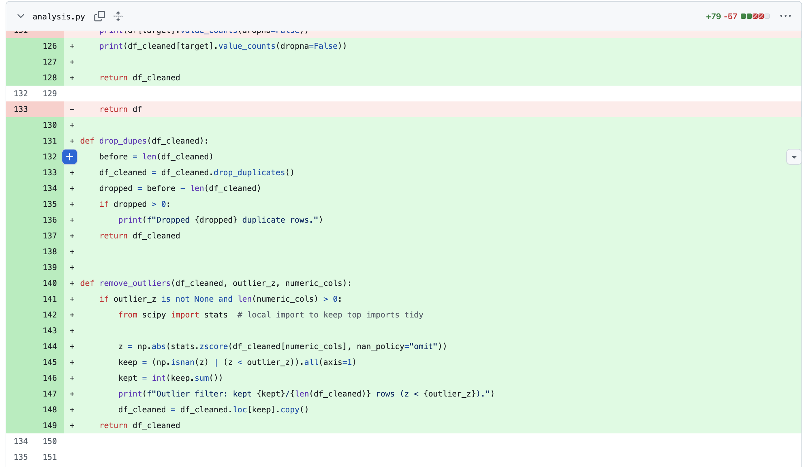

# Mini-Assignment 2 — Student Dropout & Success Analysis

[](https://github.com/anvitasuresh/IDS706_week2_DataAnalysis/actions/workflows/ci.yml)

**Course:** IDS 706 – Data Engineering  
**Goal:** We want to build a simple, end-to-end data analysis pipeline. It must include steps such as ingesting data, cleaning and preprocessing using pandas, transforming data and extracting critical features, implementing a machine learning model like random forests for feature importance, creating visualizations with matplotlib, plus comparing Polars vs Pandas performance. Additionally, create meaningful unit and system tests and set up a development environment using Dev Container and Docker. Lastly, set up Continuous Integration and refactor the code to ensure that the code is reproducible and easy to follow.

---

## Research Question
**Which factors most influence whether a student drops out, stays enrolled, or graduates?**

We analyze the Kaggle dataset **“Predict Students’ Dropout and Academic Success”**. The project aims to identify the key factors that predict dropout, continued enrollment, or graduation.  

Source: https://www.kaggle.com/datasets/thedevastator/higher-education-predictors-of-student-retention/data

---

## Repo Structure

```bash
IDS706_week2_DataAnalysis/
├── analysis.py            # main script (pandas pipeline + Polars comparison)
├── test_analysis.py       # tests main script
├── dataset.csv            # dataset used in this project
├── requirements.txt       # Python dependencies
├── Makefile               # install / lint / run helpers
├── Dockerfile             # Docker build for reproducible env
├── .devcontainer          # VS Code Dev Container setup
      └── devcontainer.json
├── .github/workflows 
      └── ci.yml           # Set up CI workflow
└── outputs/               # saved PNG visualizations
```

---

## What this project shows
- **Import the dataset:** `pandas.read_csv("dataset.csv")`
- **Inspect & Clean:**
  - Fix column names (e.g., `Nacionality` → `Nationality`)
  - Coerce likely numeric columns
  - Impute missing values and drop duplicates
  - Numeric outlier filter (z-score)
  - Encode **Target**: `Dropout=0, Enrolled=1, Graduate=2`
- **Transform (Feature Engineering):**
  - `first_sem_pass_rate = approved/enrolled (1st sem)`
  - `second_sem_pass_rate = approved/enrolled (2nd sem)`
  - `total_approved`, `avg_grade`
- **Machine Learning (beginner-friendly):**
  - Random Forest Classifier (80/20 train/test split)
  - Accuracy, classification report, confusion matrix
  - feature importance bar chart
- **Visualization:**
  - Target distribution
  - Top 10 correlations with Target
  - Age vs Target (box plot)
  - Tuition status vs Target (countplot)
  - Scholarship holder vs Target (countplot)
  - Correlation heatmap for numeric features
- **Polars:**
  - minimal cleaning/feature steps in **Polars**
  - quick **timing comparison**: load, clean, aggregate
- **Testing**
  - Unit, integration, system, and performance tests with coverage
  - Docker & VS Code Dev Containers for reproducibility and full development environment setup
  - CI workflow (GitHub Actions) with Black, Flake8, Pytest
  - Makefile for automated workflow

---
## CI/CD Pipeline and Refactoring

To automate this project, I added Continious Integration using Github Actions. This was done using a `ci.yaml` file which basically tells GitHub what to do automatically whenever you push to your repository. The following steps are outlined in the file: set up Python, install dependencies, runs linting (flake8), runs formatting check (black), runs your tests (pytest with coverage), runs the analysis script. To ensure that the workflow is running properly, go to the Actions tab and make sure the tests are passing. It should look something like the below image. 


### Renaming Variables

I also incorporated some refactoring to make the code more readable and easier to follow. To refactor code in the future, use the F2 key to rename variables and more. Some examples are shown below. Here, we renamed some data frame variables to more specific names so it is easier to follow and read. 


### Extracting Methods

It is also important to extract methods to simplify code blocks and make them easier to follow. To extract methods or variables in the future, click the Code Action light bulb or use the Quick Fix command ⌘ and choose extract method/variable. Below, we did this with a couple functions like drop duplicates and remove outliers to improve the organization of the code. 





## Setup & Usage

### 1. Create & activate a virtual environment
```bash
python -m venv .venv
source .venv/bin/activate
```
### 2. Understanding dependencies used

- **pandas>=1.3.0** – Data manipulation and analysis  
- **numpy>=1.21.0** – Numerical computing  
- **matplotlib>=3.5.0** – Data visualization  
- **seaborn** – Statistical visualizations  
- **scikit-learn>=1.0.0** – Machine learning algorithms  
- **scipy** – Statistical tools (used for outlier detection)  
- **polars>=0.20.0** – High-performance DataFrame library (performance comparison with pandas)  

### Developer Tools
- **black** – Code formatting (enforces a consistent and readable style across code by reformatting code into its own style guidelines)
- **flake8** – Code linting (checks source code for potential errors, stylistic inconsistencies, and violations of coding standards)
- **pylint** – Additional static code analysis  
- **pytest-cov** – Coverage reporting  

### 3. Running analysis

- **Clone the repository (Local)**
` git clone https://github.com/anvitasuresh/IDS706_week2_DataAnalysis.git`

- **Run analysis**
`make all` which runs the complete workflow. You can also run other make commands like `make install` to install and upgrade dependencies, `make format` to format code using black, `make lint` to lint code using flake8, `make run` to execute the analysis, and `make clean` to remove cache files. You can also run `make test` which tests the functions in analysis.py. If you want to run individual files you can use commands like `python analysis.py` or `python test_analysis.py` as well.

- **Build the Docker image and run inside container**

```bash
docker build -t dropout-analysis:dev .
docker run --rm -it -v "$PWD":/work -w /work dropout-analysis:dev bash -lc "make tests"
```

- **VS Code Dev Container**
Install Docker Desktop, VS Code, and the Dev Container extensions. Then press View → Command Palette → “Dev Containers: Reopen in Container”. Inside the container we can run make test as well. 

### 4. Testing
This project includes:
- Unit tests (data loading, cleaning, feature engineering, ML behavior)
- Integration tests (end-to-end Pandas & Polars pipelines)
- System tests (CSV → pipeline → model)
- Performance test (quick runtime check under 3s)

After you run the tests using `make test`, you should discover an output like below:


---

## Key Findings

The analysis shows several important factors that influence whether a student drops out, stays enrolled, or graduates:
- Curricular Unit Performance: Students with higher first and second semester pass rates were far more likely to graduate.
- Scholarship Status: Scholarship holders showed higher graduation rates and lower dropout rates compared to non-scholarship students.
- Tuition Fee Status:Students who kept tuition fees up-to-date had significantly lower dropout risk.
- Age at Enrollment:Younger students tended to have higher enrollment continuity, while older students showed higher dropout tendencies.

**Machine Learning Results:**
- Accuracy: ~78%
- Most Important Predictors (Random Forest feature importance): 1. Pass rates (first and second semester), 2. Total approved units, 3. Average grade, 4. Tuition fee status

**Visualization Results:**
The visualizations highlight clear relationships between certain factors and student outcomes. The target distribution plot shows that graduates make up the largest group, followed by dropouts and then currently enrolled students. Boxplots of age vs target reveal that older students are more likely to drop out, while younger students tend to graduate. Tuition fees status and scholarship plots show strong associations with outcomes—students who keep fees up to date and scholarship holders have noticeably higher graduation rates. The correlation heatmap and top 10 feature correlations confirm that academic performance metrics, such as pass rates and total approved units, are the strongest predictors of student success.

### Performance Analysis

To evaluate efficiency, we compared pandas and polars for three common steps: data loading, cleaning, and grouping.

```bash
Load:    pandas 0.0159s | polars 0.0168s
Clean:   pandas 0.0102s | polars 0.0340s
GroupBy: pandas 0.0017s | polars 0.0045s
TOTAL:   pandas 0.0278s | polars 0.0552s
Result:  Pandas faster this run
```

For this dataset, pandas performed slightly faster overall. However, the differences are small, and polars is designed to perform better on larger datasets. This exercise illustrates how performance can vary depending on dataset size and highlights the potential scalability of polars.

### Conclusion

This analysis explored the factors influencing student dropout and success using the provided dataset. Through data cleaning, feature engineering, machine learning, and visualization, we found that academic performance indicators (such as pass rates, total approved courses, and average grades) are the strongest predictors of student outcomes. Other variables (like tuition payment status and scholarships) also showed meaningful relationships with dropout or graduation probability.

Overall, the project demonstrates how a structured workflow—from data ingestion to ML and visualization—can reveal actionable insights. While pandas was sufficient for this dataset size, polars offers scalability advantages for larger datasets, making it a valuable tool for future, more complex analyses.


